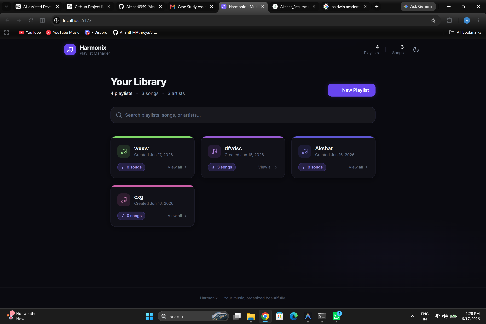

# Music Playlist Manager

A single-user, browser-based music playlist manager built with React, TypeScript, Vite, and Tailwind CSS. All data is stored in the browser's `localStorage` — no backend, no authentication, and no external APIs are required.

---

## Project Overview

Music Playlist Manager (Harmonix) lets users organize their music into named playlists. Users can create playlists, add songs to them (with title and artist), remove individual songs, and delete playlists entirely. The application persists all data locally so the library survives page refreshes. It includes a client-side search feature and a light/dark theme toggle.


*Production-quality UI for playlist creation, song management, search, persistence, and theme support.*

---

## Features

| Feature | Description |
|---|---|
| Create playlists | Enter a unique playlist name to create a new playlist |
| View all playlists | Responsive card grid showing all playlists with song counts |
| Add songs | Add songs by title and artist to any playlist |
| Remove songs | Remove individual songs with a two-step confirmation |
| Delete playlists | Delete a playlist with a two-step confirmation (from both grid and detail view) |
| Search | Instant client-side search across playlist names, song titles, and artists |
| Light / Dark theme | Toggle between light and dark modes; preference is persisted |
| Data persistence | All playlists and songs survive a full page refresh via `localStorage` |
| Duplicate prevention | Duplicate playlist names and duplicate songs (per playlist) are blocked |
| Validation | Required-field enforcement with inline error messages |
| Keyboard accessible | All controls reachable via keyboard; Escape key closes expandable forms |
| Responsive | Works on mobile, tablet, and desktop screen sizes |

---

## Setup Instructions

### Prerequisites

- Node.js v18 or later  
- npm v9 or later

### Option A — Standard (Node.js)

```bash
# 1. Clone the repository
git clone https://github.com/Akshat0359/music-playlist-manager
cd music-playlist-manager

# 2. Install dependencies
npm install

# 3. Start the development server
npm run dev
```

Open **http://localhost:5173** in your browser.

### Option B — Conda environment (pinned Node.js version)

```bash
# 1. Create and activate the environment
conda env create -f environment.yml
conda activate music-playlist-manager

# 2. Install dependencies
npm install

# 3. Start the development server
npm run dev
```

### Build and Preview

```bash
# Build the production bundle
npm run build

# Serve the production build locally
npm run preview
```

---

## Technology Stack

| Technology | Purpose | Version |
|---|---|---|
| React | UI component framework | 18 |
| TypeScript | Static typing | 5 |
| Vite | Build tool and dev server | 5 |
| Tailwind CSS | Utility-first styling | 3 |
| uuid | Unique ID generation for playlists and songs | 9 |
| Browser `localStorage` | Client-side data persistence | — |
| Inter (Google Fonts) | Typography | — |

No routing library, state management library, or backend framework is used.

---

## Assumptions Made During Development

1. **Single user** — the application is designed for one user per browser. There is no authentication or multi-user support.
2. **Frontend only** — there is no server, database, or API. All data lives in the browser.
3. **No external music APIs** — tracks are entered manually; there is no lookup, playback, or streaming.
4. **localStorage availability** — the app assumes `localStorage` is available. If it is not (e.g. private browsing with strict settings), data will not persist but the app will still function.
5. **Song uniqueness per playlist** — duplicate detection is based on the `(title, artist)` pair, case-insensitively. Two songs with the same title by different artists are permitted.
6. **Newest-first ordering** — newly created playlists appear at the top of the grid. Songs are listed in the order they were added.

---

## Validation and Error Handling

### Input Validation

All write operations go through the `usePlaylists` custom hook, which enforces the following rules before mutating state:

- **Playlist name** — required, must be unique across all playlists (case-insensitive, whitespace-trimmed), maximum 80 characters.
- **Song title** — required, maximum 120 characters.
- **Artist name** — required, maximum 120 characters.
- **Song uniqueness** — a song with the same title and artist (case-insensitive) cannot be added to the same playlist twice.

Each operation returns an `OperationResult` object (`{ success: boolean; error?: string }`), allowing forms to display targeted error messages without throwing exceptions.

### Storage Validation

On every page load, the storage layer validates each record loaded from `localStorage`:

- Missing or empty `id`, `name`, `title`, or `artist` → record is dropped silently.
- Non-array top-level value → the library is treated as empty.
- JSON parse error or storage access failure → returns an empty library without crashing.
- Invalid timestamps → fall back to the current time.

The app always initialises cleanly regardless of what was previously stored.

### Delete Confirmation

Both playlist deletion paths (from the card grid and from the detail view) require a two-step confirmation to prevent accidental data loss.

---

## Project Structure

```
music-playlist-manager/
├── src/
│   ├── components/
│   │   ├── Header.tsx              # Sticky navigation bar with stats and theme toggle
│   │   ├── CreatePlaylistForm.tsx  # Expandable form for creating playlists
│   │   ├── PlaylistCard.tsx        # Card component with delete confirmation
│   │   ├── AddSongForm.tsx         # Form for adding songs with feedback
│   │   ├── SongRow.tsx             # Track row with remove confirmation
│   │   └── EmptyState.tsx          # Empty state views (playlists, songs, search)
│   ├── views/
│   │   ├── PlaylistsView.tsx       # All-playlists page with search and grid
│   │   └── PlaylistDetailView.tsx  # Single playlist page with song list
│   ├── hooks/
│   │   └── usePlaylists.ts         # All state and CRUD logic (single source of truth)
│   ├── utils/
│   │   ├── storage.ts              # localStorage read/write with validation
│   │   └── helpers.ts              # Utility functions (normalize, formatDate, pluralize)
│   ├── types/
│   │   └── index.ts                # Shared TypeScript interfaces
│   ├── App.tsx                     # Root component; view routing via state
│   ├── main.tsx                    # React entry point
│   └── index.css                   # Tailwind directives and component classes
├── index.html                      # Entry HTML with theme pre-load script
├── environment.yml                 # Conda environment (pins Node.js 20 LTS)
├── tailwind.config.js
├── vite.config.ts
├── tsconfig.json
└── package.json
```

**View routing** is handled by a single `selectedPlaylistId` state value in `App.tsx` — no router library is needed for two views.

**State management** is a single `usePlaylists` custom hook using `useState` and `useEffect`. No Redux or Context is required at this scope.

---

## AI-Assisted Development

This project was built with the assistance of **Antigravity (Google DeepMind)**, an AI coding assistant integrated into the IDE. The AI was used throughout the development lifecycle: initial scaffolding, component architecture, TypeScript type design, Tailwind CSS theming, validation logic, defensive storage parsing, client-side search implementation, and light/dark theme switching. It also applied several refinement passes to fix issues discovered during review, including a state-updater race condition in `addSong`, invalid CSS syntax in `hsl()` values, missing delete confirmation on the detail view, unsafe `localStorage` record validation, and timer memory leaks in form components.

AI assistance was applied responsibly. The model operated within the stated product specification and respected all scope constraints (no backend, no external APIs, no authentication). All generated code was reviewed for correctness, consistency, and maintainability before being accepted. Component responsibilities are clearly separated, the custom hook is independently testable, and naming conventions are consistent throughout. The AI accelerated implementation of a well-defined spec; it did not make open-ended design decisions autonomously.

---

## Future Improvements

- Playlist sorting by name, date created, or song count
- Import and export playlists as JSON
- Drag-and-drop song reordering within a playlist
- Playlist cover image (user-uploaded)
- Service worker for offline support
